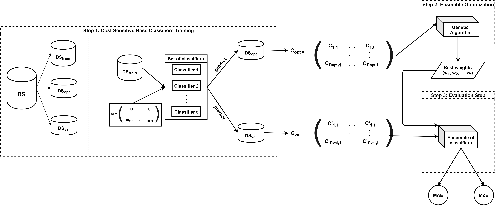

# OCEAn
**OCEAn: Ordinal Classification with an Ensemble Approach.**

Generally, classification problems catalogue instances according to their target variable, without taking into account a relation among the different labels. However, there are real problems in which the different values of the class are related to each other. Due to the interest in this type of problems, several solutions have been proposed, such as cost-sensitive classifiers. Ensembles have proven to be very effective for classification tasks, however, there are no proposals which use a genetic-based methodology as the metaheuristic to create the models. In this paper, we presente OCEAn, an Ordinal Classification algorithm based on an Ensemble Approach, which makes a final prediction according to a weighted vote. This weighted voting takes into account weights obtained by a genetic algorithm that tries to minimize the cost of classification. In order to test the performance of this approach, a comparison with ordinal classification algorithms in the literature has been carried out, proving that indeed, our approach improves previous results.

The necessary steps to carry out our methodology are enumerated in the figure below:

As explained in the paper related to this repository, in order to evaluate our approach, we carried out 5 different splits of each dataset, each split is built up by 3 partitions (train, test, validation). Each partition is identified by a number, in a way that the first 5 are the ones used to train cost-sensitive algorithms, the next 5 are used to train the genetic algorithm, and the 5 left are the ones used to validate our proposal:
    - *train partitions*: 0.arff-4.arff
    - *test_partitions*: 5.arff-9.arff
    - *validation partitions*: 10.arff-14.arff
in this way,for example, the first split is the one which comprises 0.arff, 5.arff and 10.arff files.

There are two main scripts in this repository: 
- **weka_costsensitive.py**: this file implements the first step of our methodology. It takes as input the 5 random splits which can be found in *./data_weka/*. The output of this script for each dataset comprises 15(5 splits x 3 partitions) Excel file with the predictions carried out by cost-sensitive base classifiers (the predictions can be seen in *./predictions*).

- **genetic.py**: this script implements the second and third steps of our proposal. It carries out the optimization of the ensemble by means of a genetic algorithm. In order to run this script, the predictions over the test and evaluation splits are needed (it is the which one generated by *weka_costsensitive.py*, i.e., the which one in *./predictions/*. The output of this script consists on an log file where the MAE and MZE for each of the splits is calculated, as the winning set of weights for the dataset as well. It is saved in *./genetic_output*.

The folders in this project are listed below:
- **datasets-orreview**: raw data provided by the study which we are compared [1] 
- **data_weka**: contain all the data used in Step 1, i.e., data used in weka cost-sensitive training. 
- **predictions**: Predictions carried out by cost-sensitive classifiers in Step 1.
- **genetic_output**: this folder contain the output worked out by *genetic.py**. There is one file per dataset, and each file contains the best chromosomes for each one of the 5 splits and the seed used, i.e., there are 50 best chromosomes for each dataset (5 split x 10 seeds). It can be seen MAE and MZE for each split as well.

[1] Gutierrez, P. A., Perez-Ortiz, M., Sanchez-Monedero, J., Fernandez-Navarro, F., & Hervas-Martinez, C. (2015). Ordinal regression methods: survey and experimental study. IEEE Transactions on Knowledge and Data Engineering, 28(1), 127-146.